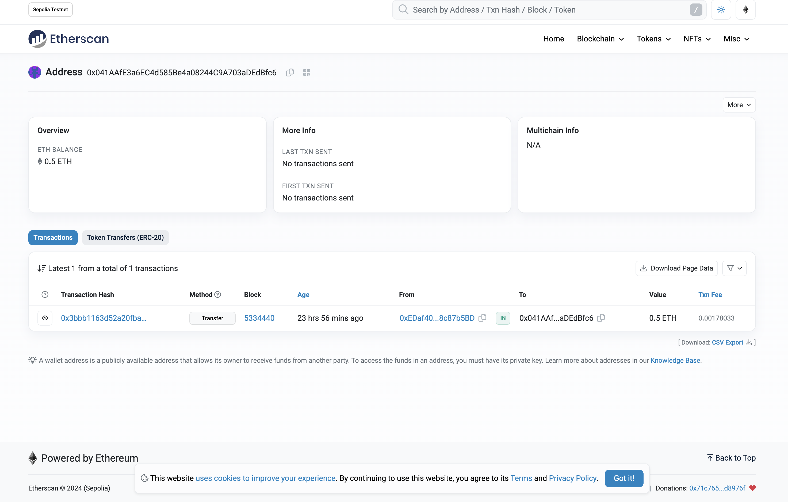

# 2024-Spring-HW0

All the detailed specified in Homework 0 documentation.

## Wallet Address
Please provide your MetaMask wallet address:
0x31D256A107A253bc17dC9c2dE874d4984d1f00c1

## Local Testing
Please provide a screenshot of the `forge test -vvv` command running in your local environment.

## Contract Address
Please provide the contract address that you deployed on the Sepolia network.
0x041AAfE3a6EC4d585Be4a08244C9A703aDEdBfc6

## Sepolia Etherscan
Paste the contract address into the Sepolia Etherscan and share the screenshot.
